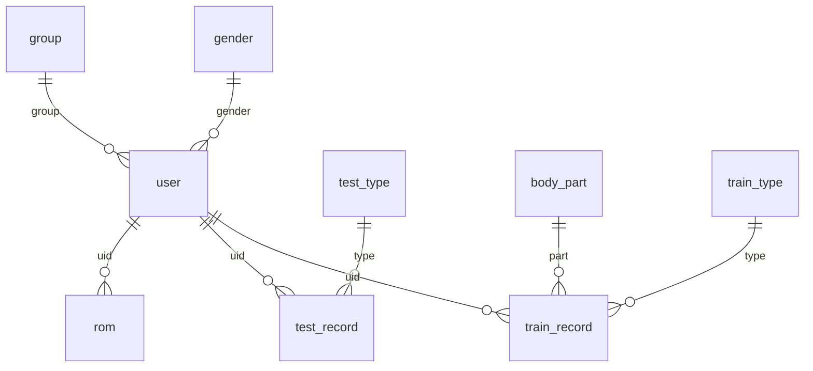

# 数据库专业结构手册

> **环境**: MySQL @ localhost | **数据库**: `ds_data_test1`
> **更新时间**: 2026-03-19 14:36:58

## 📊 数据库概览看板

| 统计项 | 数值 | 统计项 | 数值 |
| --- | --- | --- | --- |
| 物理数据表 | **9** | 数据库视图 | **3** |
| 预估总行数 | **1,440** | 采集采样深度 | **10 Lines** |

## 📂 业务模块目录

- **👤 用户与权限**
  - [gender](#表-gender)
  - [group](#表-group)
  - [user](#表-user)
- **📊 核心业务记录**
  - [rom](#表-rom)
  - [test_record](#表-testrecord)
  - [train_record](#表-trainrecord)
- **📖 系统字典配置**
  - [body_part](#表-bodypart)
  - [test_type](#表-testtype)
  - [train_type](#表-traintype)
- **👁️ 数据库视图**
  - [test_record_view](#视图-testrecordview)
  - [train_record_view](#视图-trainrecordview)
  - [user_view](#视图-userview)

---

## 🔗 逻辑关系图 (ER图)



---

## 📑 物理数据表详情

### 表: `body_part`
> 暂无描述

- 规模: `3` 行 | 占用: `16.0 KB`

| 字段名 | 类型 | 约束 | 备注 |
| --- | --- | --- | --- |
| `id` | tinyint | PK NN  |  |
| `name` | varchar(32) | NN  |  |

#### 数据预览 (Top 10)
| id | name |
| --- | --- |
| 1 | 双腿 |
| 2 | 左腿 |
| 3 | 右腿 |

---

### 表: `gender`
> 暂无描述

- 规模: `2` 行 | 占用: `16.0 KB`

| 字段名 | 类型 | 约束 | 备注 |
| --- | --- | --- | --- |
| `id` | tinyint | PK NN  |  |
| `name` | varchar(32) | NN  |  |

#### 数据预览 (Top 10)
| id | name |
| --- | --- |
| 1 | 男 |
| 2 | 女 |

---

### 表: `group`
> 暂无描述

- 规模: `10` 行 | 占用: `16.0 KB`

| 字段名 | 类型 | 约束 | 备注 |
| --- | --- | --- | --- |
| `id` | tinyint | PK NN  |  |
| `name` | varchar(32) | NN  |  |

#### 数据预览 (Top 10)
| id | name |
| --- | --- |
| 1 | 1组 |
| 2 | 2组 |
| 3 | 3组 |
| 4 | 4组 |
| 5 | 5组 |
| 6 | 6组 |
| 7 | 7组 |
| 8 | 8组 |
| 9 | 9组 |
| 10 | 10组 |

---

### 表: `rom`
> 暂无描述

- 规模: `112` 行 | 占用: `16.0 KB`

| 字段名 | 类型 | 约束 | 备注 |
| --- | --- | --- | --- |
| `id` | int | PK NN  |  |
| `uid` | int | NN  | 关联自: [`user`](#表-user)  |
| `a` | float | NN  |  |
| `b` | float | NN  |  |
| `angle1` | float | NN  |  |
| `angle2` | float | NN  |  |
| `angle3` | float | NN  |  |
| `create_time` | timestamp | NN  |  |
| `modified_time` | timestamp | NN  |  |

#### 数据预览 (Top 10)
| id | uid | a | b | angle1 | angle2 | angle3 | create_time | modified_time |
| --- | --- | --- | --- | --- | --- | --- | --- | --- |
| 1 | 1 | 31.0905 | 428.033 | 323.984 | 0.0 | 0.0 | 2024-01-03 13:37:04 | 2026-01-28 16:02:58 |
| 2 | 2 | 6.825 | 458.946 | 373.44 | 0.0 | 0.0 | 2024-01-03 13:37:24 | 2026-01-12 11:13:31 |
| 3 | 3 | 20.0 | 283.806 | 341.396 | 0.0 | 0.0 | 2024-01-04 02:33:29 | 2025-12-31 08:53:34 |
| 4 | 4 | 172.096 | 535.705 | 412.857 | 0.0 | 0.0 | 2024-01-04 10:52:02 | 2026-01-13 08:59:39 |
| 5 | 5 | 11.9484 | 404.65 | 318.793 | 0.0 | 0.0 | 2024-01-08 13:49:05 | 2026-01-13 08:56:05 |
| 6 | 6 | 189.91 | 436.701 | 310.477 | 0.0 | 0.0 | 2024-03-13 14:28:26 | 2026-01-13 09:01:51 |
| 7 | 8 | 119.327 | 429.202 | 272.092 | 0.0 | 0.0 | 2024-10-27 17:37:30 | 2025-09-09 15:09:02 |
| 8 | 245 | 59.5856 | 161.204 | 156.539 | 0.0 | 0.0 | 2024-10-28 09:39:32 | 2024-10-28 11:00:30 |
| 9 | 257 | 16.5412 | 213.138 | 194.171 | 0.0 | 0.0 | 2024-10-28 09:53:32 | 2024-10-28 09:53:32 |
| 10 | 216 | 19.9954 | 271.082 | 195.199 | 0.0 | 0.0 | 2024-10-28 09:57:03 | 2024-10-28 09:57:03 |

---

### 表: `test_record`
> 暂无描述

- 规模: `690` 行 | 占用: `128.0 KB`

| 字段名 | 类型 | 约束 | 备注 |
| --- | --- | --- | --- |
| `id` | int | PK NN  |  |
| `uid` | int | NN  | 关联自: [`user`](#表-user)  |
| `type` | tinyint | NN  | 关联自: [`test_type`](#表-testtype)  |
| `part` | tinyint |  |  |
| `cfg_roma` | int |  |  |
| `cfg_romb` | int |  |  |
| `cfg_stre` | int |  |  |
| `cfg_con_speed` | int |  |  |
| `cfg_ecc_speed` | int |  |  |
| `cfg_pos` | int |  |  |
| `cfg_group` | tinyint |  |  |
| `cfg_rest_time` | int |  |  |
| `con_stre_max` | float |  |  |
| `con_stre_avg` | float |  |  |
| `con_speed_max` | float |  |  |
| `con_speed_avg` | float |  |  |
| `con_power_max` | float |  |  |
| `con_power_avg` | float |  |  |
| `con_work_max` | float |  |  |
| `con_work_avg` | float |  |  |
| `ecc_stre_max` | float |  |  |
| `ecc_stre_avg` | float |  |  |
| `ecc_speed_max` | float |  |  |
| `ecc_speed_avg` | float |  |  |
| `ecc_power_max` | float |  |  |
| `ecc_power_avg` | float |  |  |
| `ecc_work_max` | float |  |  |
| `ecc_work_avg` | float |  |  |
| `result` | int |  |  |
| `begin_time` | timestamp | NN  |  |
| `end_time` | timestamp |  |  |
| `log` | varchar(255) |  |  |
| `video` | varchar(255) |  |  |

#### 数据预览 (Top 10)
| id | uid | type | part | cfg_roma | cfg_romb | cfg_stre | cfg_con_speed | cfg_ecc_speed | cfg_pos | cfg_group | cfg_rest_time | con_stre_max | con_stre_avg | con_speed_max | con_speed_avg | con_power_max | con_power_avg | con_work_max | con_work_avg | ecc_stre_max | ecc_stre_avg | ecc_speed_max | ecc_speed_avg | ecc_power_max | ecc_power_avg | ecc_work_max | ecc_work_avg | result | begin_time | end_time | log | video |
| --- | --- | --- | --- | --- | --- | --- | --- | --- | --- | --- | --- | --- | --- | --- | --- | --- | --- | --- | --- | --- | --- | --- | --- | --- | --- | --- | --- | --- | --- | --- | --- | --- |
| 1 | 4 | 2 | 1 | 111 | 325 | *NULL* | *NULL* | *NULL* | *NULL* | 3 | 30 | *NULL* | *NULL* | *NULL* | *NULL* | *NULL* | *NULL* | *NULL* | *NULL* | *NULL* | *NULL* | *NULL* | *NULL* | *NULL* | *NULL* | *NULL* | *NULL* | *NULL* | 2024-02-21 23:08:55 | *NULL* | ./log/2024-02-21/23-08-55.csv | *NULL* |
| 2 | 4 | 1 | 1 | 111 | 325 | *NULL* | *NULL* | *NULL* | *NULL* | 3 | 30 | *NULL* | *NULL* | *NULL* | *NULL* | *NULL* | *NULL* | *NULL* | *NULL* | *NULL* | *NULL* | *NULL* | *NULL* | *NULL* | *NULL* | *NULL* | *NULL* | *NULL* | 2024-02-21 23:11:24 | *NULL* | ./log/2024-02-21/23-11-24.csv | *NULL* |
| 3 | 4 | 3 | 1 | 111 | 325 | *NULL* | *NULL* | *NULL* | *NULL* | 3 | 30 | *NULL* | *NULL* | *NULL* | *NULL* | *NULL* | *NULL* | *NULL* | *NULL* | *NULL* | *NULL* | *NULL* | *NULL* | *NULL* | *NULL* | *NULL* | *NULL* | *NULL* | 2024-02-21 23:14:08 | *NULL* | ./log/2024-02-21/23-14-08.csv | *NULL* |
| 4 | 4 | 2 | 1 | 111 | 325 | 50 | *NULL* | *NULL* | *NULL* | 3 | 30 | *NULL* | *NULL* | *NULL* | *NULL* | *NULL* | *NULL* | *NULL* | *NULL* | *NULL* | *NULL* | *NULL* | *NULL* | *NULL* | *NULL* | *NULL* | *NULL* | *NULL* | 2024-02-21 23:17:05 | *NULL* | ./log/2024-02-21/23-17-05.csv | *NULL* |
| 5 | 4 | 1 | 1 | 111 | 325 | *NULL* | *NULL* | *NULL* | *NULL* | 3 | 30 | *NULL* | *NULL* | *NULL* | *NULL* | *NULL* | *NULL* | *NULL* | *NULL* | *NULL* | *NULL* | *NULL* | *NULL* | *NULL* | *NULL* | *NULL* | *NULL* | 0 | 2024-02-21 23:22:02 | 2024-02-21 23:24:12 | ./log/2024-02-21/23-22-02.csv |  |
| 6 | 4 | 2 | 1 | 111 | 325 | 50 | *NULL* | *NULL* | *NULL* | 3 | 30 | *NULL* | *NULL* | *NULL* | *NULL* | *NULL* | *NULL* | *NULL* | *NULL* | *NULL* | *NULL* | *NULL* | *NULL* | *NULL* | *NULL* | *NULL* | *NULL* | 0 | 2024-02-21 23:27:03 | 2024-02-21 23:29:13 | ./log/2024-02-21/23-27-03.csv |  |
| 7 | 4 | 1 | 1 | 111 | 325 | *NULL* | 100 | 100 | *NULL* | 3 | 30 | *NULL* | *NULL* | *NULL* | *NULL* | *NULL* | *NULL* | *NULL* | *NULL* | *NULL* | *NULL* | *NULL* | *NULL* | *NULL* | *NULL* | *NULL* | *NULL* | 0 | 2024-02-21 23:30:30 | 2024-02-21 23:32:40 | ./log/2024-02-21/23-30-30.csv |  |
| 8 | 4 | 3 | 1 | 111 | 325 | *NULL* | *NULL* | *NULL* | *NULL* | 3 | 30 | *NULL* | *NULL* | *NULL* | *NULL* | *NULL* | *NULL* | *NULL* | *NULL* | *NULL* | *NULL* | *NULL* | *NULL* | *NULL* | *NULL* | *NULL* | *NULL* | *NULL* | 2024-02-21 23:32:49 | *NULL* | ./log/2024-02-21/23-32-49.csv | *NULL* |
| 9 | 2 | 3 | 1 | 136 | 401 | *NULL* | *NULL* | *NULL* | 151 | 3 | 30 | *NULL* | *NULL* | *NULL* | *NULL* | *NULL* | *NULL* | *NULL* | *NULL* | *NULL* | *NULL* | *NULL* | *NULL* | *NULL* | *NULL* | *NULL* | *NULL* | 0 | 2024-02-21 23:41:12 | 2024-02-21 23:42:52 | ./log/2024-02-21/23-41-12.csv |  |
| 10 | 2 | 1 | 1 | 136 | 401 | *NULL* | 100 | 100 | *NULL* | 3 | 30 | *NULL* | *NULL* | *NULL* | *NULL* | *NULL* | *NULL* | *NULL* | *NULL* | *NULL* | *NULL* | *NULL* | *NULL* | *NULL* | *NULL* | *NULL* | *NULL* | 0 | 2024-02-21 23:43:10 | 2024-02-21 23:44:50 | ./log/2024-02-21/23-43-10.csv |  |

---

### 表: `test_type`
> 暂无描述

- 规模: `3` 行 | 占用: `16.0 KB`

| 字段名 | 类型 | 约束 | 备注 |
| --- | --- | --- | --- |
| `id` | tinyint | PK NN  |  |
| `name` | varchar(255) | NN  |  |

#### 数据预览 (Top 10)
| id | name |
| --- | --- |
| 1 | 等速测试 |
| 2 | 等张测试 |
| 3 | 等长测试 |

---

### 表: `train_record`
> 暂无描述

- 规模: `421` 行 | 占用: `80.0 KB`

| 字段名 | 类型 | 约束 | 备注 |
| --- | --- | --- | --- |
| `id` | int | PK NN  |  |
| `uid` | int | NN  | 关联自: [`user`](#表-user)  |
| `type` | tinyint | NN  | 关联自: [`train_type`](#表-traintype)  |
| `part` | tinyint | NN  | 关联自: [`body_part`](#表-bodypart)  |
| `cfg_roma` | int |  |  |
| `cfg_romb` | int |  |  |
| `cfg_con_stre` | int |  |  |
| `cfg_ecc_stre` | int |  |  |
| `cfg_con_speed` | int |  |  |
| `cfg_ecc_speed` | int |  |  |
| `cfg_train_time` | int |  |  |
| `cfg_relax_time` | int |  |  |
| `cfg_train_pos` | int |  |  |
| `cfg_count` | tinyint |  |  |
| `cfg_group` | tinyint |  |  |
| `cfg_rest_time` | int |  |  |
| `con_stre_max` | float |  |  |
| `con_stre_avg` | float |  |  |
| `con_speed_max` | float |  |  |
| `con_speed_avg` | float |  |  |
| `con_power_max` | float |  |  |
| `con_power_avg` | float |  |  |
| `con_work_max` | float |  |  |
| `con_work_avg` | float |  |  |
| `ecc_stre_max` | float |  |  |
| `ecc_stre_avg` | float |  |  |
| `ecc_speed_max` | float |  |  |
| `ecc_speed_avg` | float |  |  |
| `ecc_power_max` | float |  |  |
| `ecc_power_avg` | float |  |  |
| `ecc_work_max` | float |  |  |
| `ecc_work_avg` | float |  |  |
| `result` | int |  |  |
| `begin_time` | timestamp | NN  |  |
| `end_time` | timestamp |  |  |
| `log` | varchar(255) |  |  |
| `video` | varchar(255) |  |  |

#### 数据预览 (Top 10)
| id | uid | type | part | cfg_roma | cfg_romb | cfg_con_stre | cfg_ecc_stre | cfg_con_speed | cfg_ecc_speed | cfg_train_time | cfg_relax_time | cfg_train_pos | cfg_count | cfg_group | cfg_rest_time | con_stre_max | con_stre_avg | con_speed_max | con_speed_avg | con_power_max | con_power_avg | con_work_max | con_work_avg | ecc_stre_max | ecc_stre_avg | ecc_speed_max | ecc_speed_avg | ecc_power_max | ecc_power_avg | ecc_work_max | ecc_work_avg | result | begin_time | end_time | log | video |
| --- | --- | --- | --- | --- | --- | --- | --- | --- | --- | --- | --- | --- | --- | --- | --- | --- | --- | --- | --- | --- | --- | --- | --- | --- | --- | --- | --- | --- | --- | --- | --- | --- | --- | --- | --- | --- |
| 1 | 2 | 2 | 1 | *NULL* | *NULL* | *NULL* | *NULL* | *NULL* | *NULL* | *NULL* | *NULL* | *NULL* | *NULL* | *NULL* | *NULL* | *NULL* | *NULL* | *NULL* | *NULL* | *NULL* | *NULL* | *NULL* | *NULL* | *NULL* | *NULL* | *NULL* | *NULL* | *NULL* | *NULL* | *NULL* | *NULL* | *NULL* | 2024-01-09 15:32:43 | *NULL* | ./log/2024-01-09/15-32-42.csv | *NULL* |
| 2 | 3 | 2 | 1 | *NULL* | *NULL* | *NULL* | *NULL* | *NULL* | *NULL* | *NULL* | *NULL* | *NULL* | *NULL* | *NULL* | *NULL* | *NULL* | *NULL* | *NULL* | *NULL* | *NULL* | *NULL* | *NULL* | *NULL* | *NULL* | *NULL* | *NULL* | *NULL* | *NULL* | *NULL* | *NULL* | *NULL* | 0 | 2024-01-09 15:34:06 | 2024-01-09 15:36:17 | ./log/2024-01-09/15-34-06.csv |  |
| 3 | 3 | 3 | 1 | *NULL* | *NULL* | *NULL* | *NULL* | *NULL* | *NULL* | *NULL* | *NULL* | *NULL* | *NULL* | *NULL* | *NULL* | *NULL* | *NULL* | *NULL* | *NULL* | *NULL* | *NULL* | *NULL* | *NULL* | *NULL* | *NULL* | *NULL* | *NULL* | *NULL* | *NULL* | *NULL* | *NULL* | *NULL* | 2024-01-12 02:57:52 | *NULL* | ./log/2024-01-12/02-57-48.csv | *NULL* |
| 4 | 4 | 3 | 1 | *NULL* | *NULL* | *NULL* | *NULL* | *NULL* | *NULL* | *NULL* | *NULL* | *NULL* | *NULL* | *NULL* | *NULL* | *NULL* | *NULL* | *NULL* | *NULL* | *NULL* | *NULL* | *NULL* | *NULL* | *NULL* | *NULL* | *NULL* | *NULL* | *NULL* | *NULL* | *NULL* | *NULL* | *NULL* | 2024-01-12 03:09:33 | *NULL* | ./log/2024-01-12/03-09-33.csv | *NULL* |
| 5 | 3 | 5 | 1 | *NULL* | *NULL* | *NULL* | *NULL* | *NULL* | *NULL* | *NULL* | *NULL* | *NULL* | *NULL* | *NULL* | *NULL* | *NULL* | *NULL* | *NULL* | *NULL* | *NULL* | *NULL* | *NULL* | *NULL* | *NULL* | *NULL* | *NULL* | *NULL* | *NULL* | *NULL* | *NULL* | *NULL* | *NULL* | 2024-01-16 12:11:58 | *NULL* | ./log/2024-01-16/12-11-56.csv | *NULL* |
| 6 | 3 | 5 | 1 | *NULL* | *NULL* | *NULL* | *NULL* | *NULL* | *NULL* | *NULL* | *NULL* | *NULL* | *NULL* | *NULL* | *NULL* | *NULL* | *NULL* | *NULL* | *NULL* | *NULL* | *NULL* | *NULL* | *NULL* | *NULL* | *NULL* | *NULL* | *NULL* | *NULL* | *NULL* | *NULL* | *NULL* | *NULL* | 2024-01-16 12:13:47 | *NULL* | ./log/2024-01-16/12-13-47.csv | *NULL* |
| 7 | 3 | 5 | 1 | *NULL* | *NULL* | *NULL* | *NULL* | *NULL* | *NULL* | *NULL* | *NULL* | *NULL* | *NULL* | *NULL* | *NULL* | *NULL* | *NULL* | *NULL* | *NULL* | *NULL* | *NULL* | *NULL* | *NULL* | *NULL* | *NULL* | *NULL* | *NULL* | *NULL* | *NULL* | *NULL* | *NULL* | *NULL* | 2024-01-16 12:29:08 | *NULL* | ./log/2024-01-16/12-29-08.csv | *NULL* |
| 8 | 3 | 5 | 1 | *NULL* | *NULL* | *NULL* | *NULL* | *NULL* | *NULL* | *NULL* | *NULL* | *NULL* | *NULL* | *NULL* | *NULL* | *NULL* | *NULL* | *NULL* | *NULL* | *NULL* | *NULL* | *NULL* | *NULL* | *NULL* | *NULL* | *NULL* | *NULL* | *NULL* | *NULL* | *NULL* | *NULL* | *NULL* | 2024-01-16 12:37:03 | *NULL* | ./log/2024-01-16/12-37-01.csv | *NULL* |
| 9 | 3 | 1 | 1 | *NULL* | *NULL* | *NULL* | *NULL* | *NULL* | *NULL* | *NULL* | *NULL* | *NULL* | *NULL* | *NULL* | *NULL* | *NULL* | *NULL* | *NULL* | *NULL* | *NULL* | *NULL* | *NULL* | *NULL* | *NULL* | *NULL* | *NULL* | *NULL* | *NULL* | *NULL* | *NULL* | *NULL* | *NULL* | 2024-01-17 13:39:16 | *NULL* | ./log/2024-01-17/13-39-16.csv | *NULL* |
| 10 | 3 | 1 | 1 | *NULL* | *NULL* | *NULL* | *NULL* | *NULL* | *NULL* | *NULL* | *NULL* | *NULL* | *NULL* | *NULL* | *NULL* | *NULL* | *NULL* | *NULL* | *NULL* | *NULL* | *NULL* | *NULL* | *NULL* | *NULL* | *NULL* | *NULL* | *NULL* | *NULL* | *NULL* | *NULL* | *NULL* | *NULL* | 2024-01-17 13:45:14 | *NULL* | ./log/2024-01-17/13-45-14.csv | *NULL* |

---

### 表: `train_type`
> 暂无描述

- 规模: `6` 行 | 占用: `16.0 KB`

| 字段名 | 类型 | 约束 | 备注 |
| --- | --- | --- | --- |
| `id` | tinyint | PK NN  |  |
| `name` | varchar(255) | NN  |  |

#### 数据预览 (Top 10)
| id | name |
| --- | --- |
| 1 | 等速训练 |
| 2 | 等张训练 |
| 3 | 等长训练 |
| 4 | 离心训练 |
| 5 | 自适应训练 |
| 6 | 爆发力训练 |

---

### 表: `user`
> 暂无描述

- 规模: `193` 行 | 占用: `16.0 KB`

| 字段名 | 类型 | 约束 | 备注 |
| --- | --- | --- | --- |
| `id` | int | PK NN  |  |
| `name` | varchar(255) | NN  |  |
| `gender` | tinyint |  | 关联自: [`gender`](#表-gender)  |
| `age` | tinyint |  |  |
| `height` | smallint |  |  |
| `weight` | float |  | 体重(kg) |
| `phone` | varchar(255) |  |  |
| `id_number` | varchar(255) |  |  |
| `group` | tinyint |  | 关联自: [`group`](#表-group)  |
| `birthday` | date |  |  |
| `remark` | varchar(255) |  |  |
| `description` | varchar(255) |  |  |
| `create_time` | timestamp | NN  |  |
| `modified_time` | timestamp | NN  |  |
| `is_deleted` | tinyint | NN  |  |

#### 数据预览 (Top 10)
| id | name | gender | age | height | weight | phone | id_number | group | birthday | remark | description | create_time | modified_time | is_deleted |
| --- | --- | --- | --- | --- | --- | --- | --- | --- | --- | --- | --- | --- | --- | --- |
| 1 | 李雷 | 1 | 25 | 180 | 70.0 | *NULL* | 301001 | 1 | 1990-01-05 | *NULL* | *NULL* | 2023-12-30 13:26:05 | 2023-12-30 13:26:05 | 0 |
| 2 | 张伟 | 1 | 18 | 185 | 80.0 | *NULL* | 301002 | 1 | 2001-02-05 | *NULL* | *NULL* | 2023-12-30 13:29:47 | 2023-12-30 13:29:47 | 0 |
| 3 | 王强 | 1 | 23 | 180 | 75.0 | *NULL* | 301003 | 2 | 1999-10-03 | *NULL* | *NULL* | 2023-12-30 13:30:40 | 2023-12-30 13:30:40 | 0 |
| 4 | 王娟 | 2 | 22 | 165 | 50.0 | *NULL* | 203001 | 2 | 1999-11-20 | *NULL* | *NULL* | 2023-12-30 13:31:01 | 2023-12-30 13:31:01 | 0 |
| 5 | 刘梅 | 2 | 18 | 160 | 50.0 | *NULL* | 203002 | 1 | 2000-08-09 | *NULL* | *NULL* | 2023-12-30 13:31:22 | 2023-12-30 13:31:22 | 0 |
| 6 | 赵云 | 1 | *NULL* | 182 | 72.0 | *NULL* | 403305 | 3 | 1995-05-08 | *NULL* | *NULL* | 2024-01-16 02:23:01 | 2024-01-16 02:23:01 | 0 |
| 7 | 王吉权 | 2 | *NULL* | 167 | 60.0 | *NULL* | 5001 | 1 | 1998-01-05 | *NULL* | *NULL* | 2024-06-27 12:00:35 | 2024-06-27 12:00:35 | 0 |
| 8 | 孔俊浩 | 1 | *NULL* | 176 | 75.0 | *NULL* | 5002 | 2 | 1998-01-06 | *NULL* | *NULL* | 2024-06-27 12:00:35 | 2024-06-27 12:00:35 | 0 |
| 209 | 陈芃峄 | 1 | *NULL* | 192 | 110.0 | *NULL* | 5001 | 4 | 2007-02-18 | *NULL* | *NULL* | 2024-10-26 08:15:15 | 2024-10-26 08:15:15 | 0 |
| 210 | 费傲宁 | 2 | *NULL* | 172 | 90.0 | *NULL* | 5002 | 4 | 2004-06-30 | *NULL* | *NULL* | 2024-10-26 08:15:15 | 2024-10-26 08:15:15 | 0 |

---

## 👁️ 数据库视图详情

### 视图: `test_record_view`
#### 数据预览 (Top 10)
| id | user_name | id_number | group_name | part_name | type_name | time | uid | group_id | part_id | type_id |
| --- | --- | --- | --- | --- | --- | --- | --- | --- | --- | --- |
| 5 | 王娟 | 203001 | 2组 | 双腿 | 等速测试 | 2024-02-21 23:22:02 | 4 | 2 | 1 | 1 |
| 6 | 王娟 | 203001 | 2组 | 双腿 | 等张测试 | 2024-02-21 23:27:03 | 4 | 2 | 1 | 2 |
| 7 | 王娟 | 203001 | 2组 | 双腿 | 等速测试 | 2024-02-21 23:30:30 | 4 | 2 | 1 | 1 |
| 9 | 张伟 | 301002 | 1组 | 双腿 | 等长测试 | 2024-02-21 23:41:12 | 2 | 1 | 1 | 3 |
| 10 | 张伟 | 301002 | 1组 | 双腿 | 等速测试 | 2024-02-21 23:43:10 | 2 | 1 | 1 | 1 |
| 11 | 张伟 | 301002 | 1组 | 双腿 | 等张测试 | 2024-02-21 23:45:59 | 2 | 1 | 1 | 2 |
| 12 | 王强 | 301003 | 2组 | 双腿 | 等速测试 | 2024-02-26 10:56:32 | 3 | 2 | 1 | 1 |
| 13 | 王强 | 301003 | 2组 | 双腿 | 等长测试 | 2024-02-26 11:00:54 | 3 | 2 | 1 | 3 |
| 14 | 王强 | 301003 | 2组 | 双腿 | 等张测试 | 2024-02-26 11:07:20 | 3 | 2 | 1 | 2 |
| 15 | 王强 | 301003 | 2组 | 双腿 | 等张测试 | 2024-02-26 11:09:51 | 3 | 2 | 1 | 2 |

<details><summary>查看 SQL 源码</summary>

```sql
CREATE ALGORITHM=UNDEFINED DEFINER=`root`@`localhost` SQL SECURITY DEFINER VIEW `test_record_view` AS select `tr`.`id` AS `id`,`u`.`name` AS `user_name`,`u`.`id_number` AS `id_number`,`g`.`name` AS `group_name`,`bp`.`name` AS `part_name`,`tt`.`name` AS `type_name`,`tr`.`begin_time` AS `time`,`tr`.`uid` AS `uid`,`u`.`group` AS `group_id`,`tr`.`part` AS `part_id`,`tr`.`type` AS `type_id` from ((((`user` `u` join `test_record` `tr`) join `test_type` `tt`) join `body_part` `bp`) join `group` `g`) where ((`u`.`id` = `tr`.`uid`) and (`tr`.`type` = `tt`.`id`) and (`tr`.`part` = `bp`.`id`) and (`u`.`group` = `g`.`id`) and (`tr`.`end_time` is not null))
```

</details>

---

### 视图: `train_record_view`
#### 数据预览 (Top 10)
| id | user_name | id_number | group_name | part_name | type_name | time | uid | group_id | part_id | type_id |
| --- | --- | --- | --- | --- | --- | --- | --- | --- | --- | --- |
| 201 | 赵云 | 403305 | 3组 | 双腿 | 爆发力训练 | 2024-03-13 15:04:03 | 6 | 3 | 1 | 6 |
| 132 | 李雷 | 301001 | 1组 | 双腿 | 爆发力训练 | 2024-02-26 13:56:05 | 1 | 1 | 1 | 6 |
| 101 | 王强 | 301003 | 2组 | 双腿 | 爆发力训练 | 2024-02-26 10:53:40 | 3 | 2 | 1 | 6 |
| 205 | 赵云 | 403305 | 3组 | 双腿 | 自适应训练 | 2024-03-13 15:37:28 | 6 | 3 | 1 | 5 |
| 188 | 王强 | 301003 | 2组 | 双腿 | 自适应训练 | 2024-03-12 13:48:09 | 3 | 2 | 1 | 5 |
| 107 | 王强 | 301003 | 2组 | 双腿 | 自适应训练 | 2024-02-26 11:18:17 | 3 | 2 | 1 | 5 |
| 303 | 张伟 | 301002 | 1组 | 双腿 | 离心训练 | 2025-06-03 09:07:29 | 2 | 1 | 1 | 4 |
| 203 | 赵云 | 403305 | 3组 | 双腿 | 离心训练 | 2024-03-13 15:14:59 | 6 | 3 | 1 | 4 |
| 187 | 王强 | 301003 | 2组 | 双腿 | 离心训练 | 2024-03-12 13:46:04 | 3 | 2 | 1 | 4 |
| 114 | 王强 | 301003 | 2组 | 双腿 | 离心训练 | 2024-02-26 11:28:46 | 3 | 2 | 1 | 4 |

<details><summary>查看 SQL 源码</summary>

```sql
CREATE ALGORITHM=UNDEFINED DEFINER=`root`@`localhost` SQL SECURITY DEFINER VIEW `train_record_view` AS select `tr`.`id` AS `id`,`u`.`name` AS `user_name`,`u`.`id_number` AS `id_number`,`g`.`name` AS `group_name`,`bp`.`name` AS `part_name`,`tt`.`name` AS `type_name`,`tr`.`begin_time` AS `time`,`tr`.`uid` AS `uid`,`u`.`group` AS `group_id`,`tr`.`part` AS `part_id`,`tr`.`type` AS `type_id` from ((((`user` `u` join `train_record` `tr`) join `train_type` `tt`) join `body_part` `bp`) join `group` `g`) where ((`u`.`id` = `tr`.`uid`) and (`tr`.`type` = `tt`.`id`) and (`tr`.`part` = `bp`.`id`) and (`u`.`group` = `g`.`id`) and (`tr`.`end_time` is not null))
```

</details>

---

### 视图: `user_view`
#### 数据预览 (Top 10)
| id | name | gender | age | id_number | group | height | weight |
| --- | --- | --- | --- | --- | --- | --- | --- |
| 1 | 李雷 | 男 | 36 | 301001 | 1 | 180 | 70.0 |
| 2 | 张伟 | 男 | 25 | 301002 | 1 | 185 | 80.0 |
| 3 | 王强 | 男 | 26 | 301003 | 2 | 180 | 75.0 |
| 6 | 赵云 | 男 | 30 | 403305 | 3 | 182 | 72.0 |
| 8 | 孔俊浩 | 男 | 28 | 5002 | 2 | 176 | 75.0 |
| 209 | 陈芃峄 | 男 | 19 | 5001 | 4 | 192 | 110.0 |
| 211 | 高鑫磊 | 男 | 21 | 5003 | 4 | 185 | 70.0 |
| 212 | 郭海天 | 男 | 19 | 5004 | 4 | 187 | 75.0 |
| 213 | 井庆泽 | 男 | 19 | 5005 | 4 | 180 | 76.0 |
| 214 | 孔祥宇 | 男 | 20 | 5006 | 4 | 185 | 80.0 |

<details><summary>查看 SQL 源码</summary>

```sql
CREATE ALGORITHM=UNDEFINED DEFINER=`root`@`localhost` SQL SECURITY DEFINER VIEW `user_view` AS select `u`.`id` AS `id`,`u`.`name` AS `name`,`g`.`name` AS `gender`,timestampdiff(YEAR,`u`.`birthday`,curdate()) AS `age`,`u`.`id_number` AS `id_number`,`u`.`group` AS `group`,`u`.`height` AS `height`,`u`.`weight` AS `weight` from (`user` `u` join `gender` `g`) where (`u`.`gender` = `g`.`id`)
```

</details>

---

